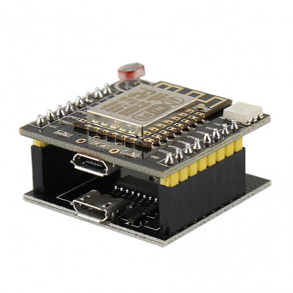

# Witty Board

## Hardware

Espressif ESP8266 chip

* 802.11 b/g/n
* Wi-Fi Direct (P2P), soft-AP
* Integrated TCP/IP protocol stack
* Integrated TR switch, balun, LNA, power amplifier and matching network
* Integrated PLLs, regulators, DCXO and power management units
* +19.5dBm output power in 802.11b mode
* Power down leakage current of <10uA
* 1MB Flash Memory
* Integrated low power 32-bit CPU could be used as application processor
* SDIO 1.1 / 2.0, SPI, UART
* STBC, 1x1 MIMO, 2x1 MIMO
* A-MPDU & A-MSDU aggregation & 0.4ms guard interval
* Wake up and transmit packets in < 2ms
* Standby power consumption of < 1.0mW (DTIM3)

Witty board

* button
* RGB LED
* photoresistor
* flashing board with [CH340G](http://kig.re/2014/12/31/how-to-use-arduino-nano-mini-pro-with-CH340G-on-mac-osx-yosemite.html) USB-serial converter and flash/reset buttons

## SDKs

* [NodeMCU](https://github.com/nodemcu/nodemcu-firmware)
* [Arduino](https://github.com/esp8266/Arduino)
* [MicroPython](https://github.com/micropython/micropython/tree/master/esp8266)

## Resources

* [WittyCloudTest](https://github.com/AdySan/WittyCloudTest)
* [ESP8266 Community Forum](http://www.esp8266.com/)
